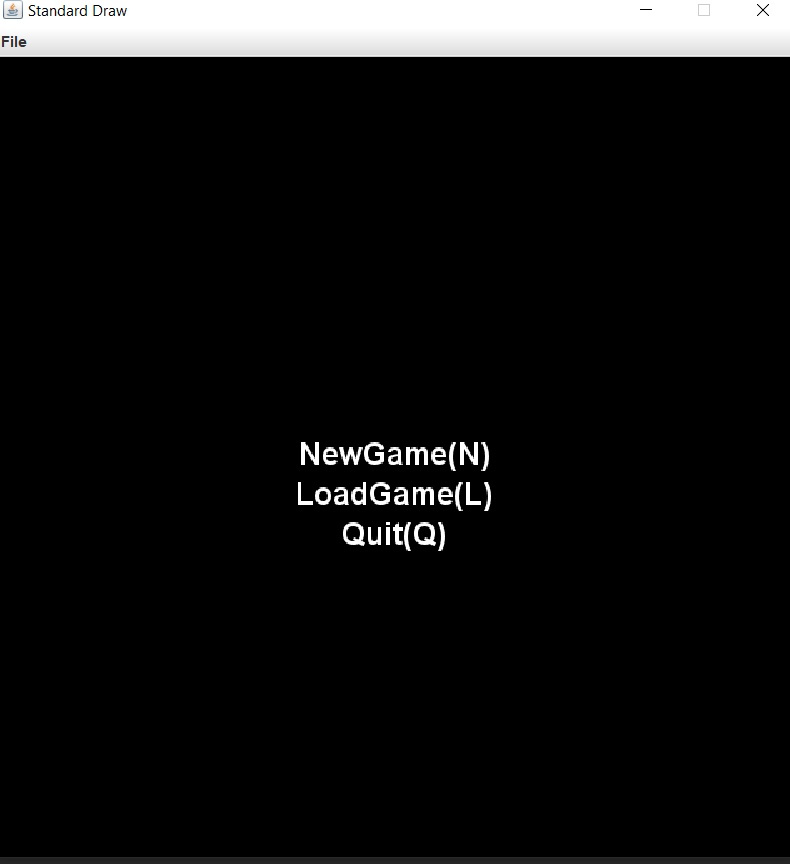
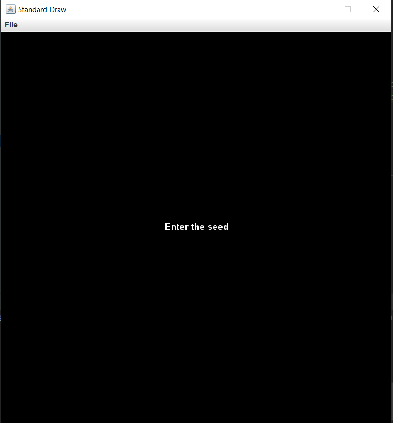
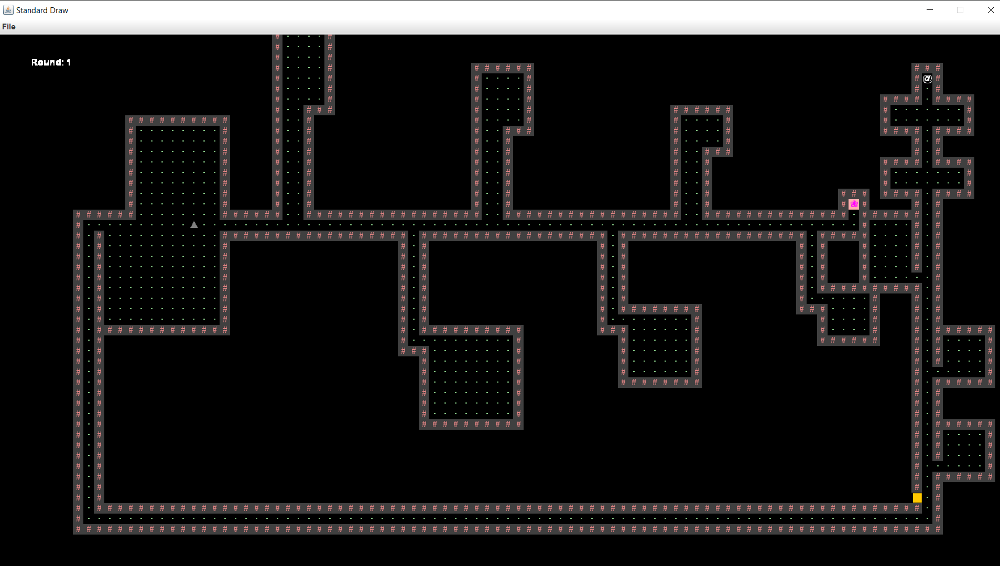
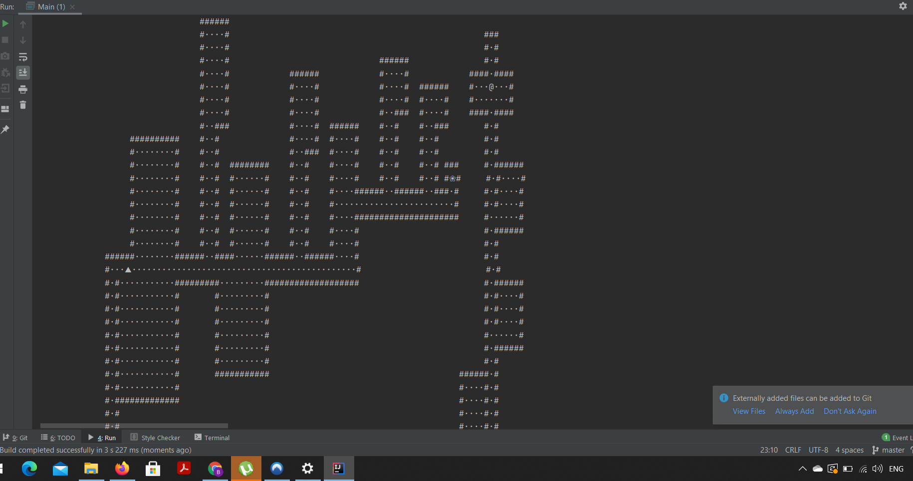

# WorldGenerationGame.

In this project, I have designed and implemented a 2D tile-based game.

In the first part of the project I have created a world generator (pseudorandomly generated), which means that when every time the user starts the game, the world is 
generated randomly and different.

In the second part of the project I have added interactivity to the game, in which the player can move in the world and take points or be destroyed by the monster.

Rules of The game: 
- When the user starts the game, he has to move in the world and collect all the flowers in it and then go to the yellow locked door without being touched
 by the monster. If the monster touched the player, the player would lose. The player can move in 4 different ways Up by pressing w, Down by pressing s, Right by
 pressing d, and left by pressing a.

- The game difficulty changes every round. Every round, the monster speed increases and when the player reaches half the game (round 5) another monster appears
and the game becomes more difficult.

How to play the game:
- The game can be played by 2 different ways. The first way is by using keyboard. Simply go to Main.java and run it without passing any arguments. In this case,
You have to choose between NewGame, LoadGame, and Quit.

To start NewGame press n, To LoadGame press l, To Quit press q. If it is your first time playing the
game, you will choose n. After that the game will ask you to enter the seed.

The seed can be any number starts from 0 to 9,223,372,036,854,775,807 (Every number generates different world) Important: After entering the seed, you have to press s.

After pressing s, a description of how to win the round will be displayed to you and then the game will start.

after that you will play the game with the rules I have mentioned above. You can quit the game and
save your efforts any time in the game by pressing q. And then when starting again You have to press L to load the game. In that way you will be starting in the same 
state that you left the game in it.

- The second way in which you can play the game is by using inputString (This way is very beneficial in testing). Go to Main.java and run it by passing String argument to it.
For example, Passing the string “N543SSSSSSWW”. 

Passing the string “N543SSSSSSWW” corresponds to the user starting a game with the seed 543, then moving down 5 times, then up twice. In this way the game will be showed to you static and you can't play like the first way.

 
